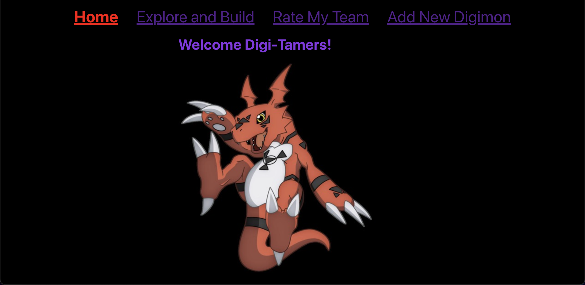
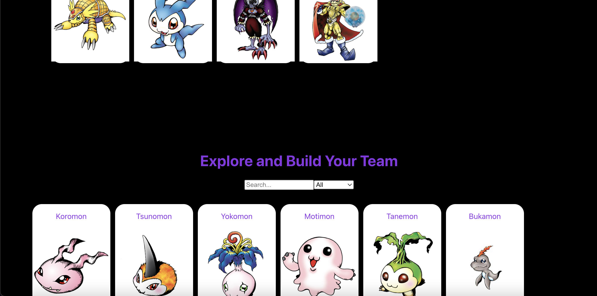
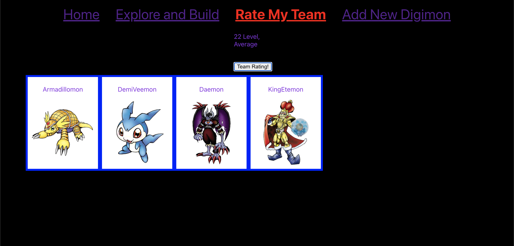
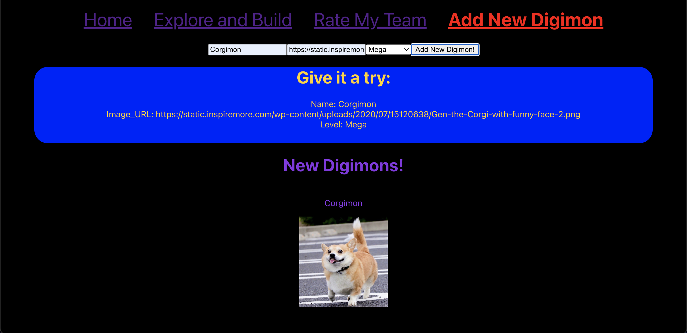

# Digimon-Phase-2-Project

## Overview
The application allowes users to explore and build their very own Digimon Teams from the original Digimon collection. Also, users can create and upload their very own Digimon by including an image, level, and name. Lastly, users can also have their built rated! They can see if their teams need work, are satisfactory, or broken!

### Features and Description
- Home Page - the homepage welcomes users with a Digimon to greet them!

 

- Explore and Build Page - filter and sort through the large library of Digimons. Clicking on the Digimon will add them to the team and clicking on added Digimons will remove them.

 

- Rate My Team Page - the page contains the team built by the user along with a button. When the button is Clicked, the page will return a numerical value and comment on the users built team.

 

- Add New Digimon - when the form is filled and submitted, the page will create a new Digimon and upload it to a new library of created Digimons. You may also click on the digimon to delete from the library.

 

#### How to Run

`npm start`

Runs the app in the development mode.
Open [http://localhost:3000](http://localhost:3000) to view it in your browser.

The page will reload when you make changes.
You may also see any lint errors in the console.

`json-server -p 8000 db.json`

In a seperate terminal, run a json-server in port 8000. That way, the npm start and json-server will not conflict with one another.


**LIVE LINK:**

## Installation

```
npm install -g node-modules
```

```
npm install -g json-server
```

```
npm install react-router-dom
```

```
npm install react-router-dom@5.2.0
```


## Authors and acknowledgment
All images used in this application belong rightfully to Bandai Entertainment, Inc and the Digimon Company.